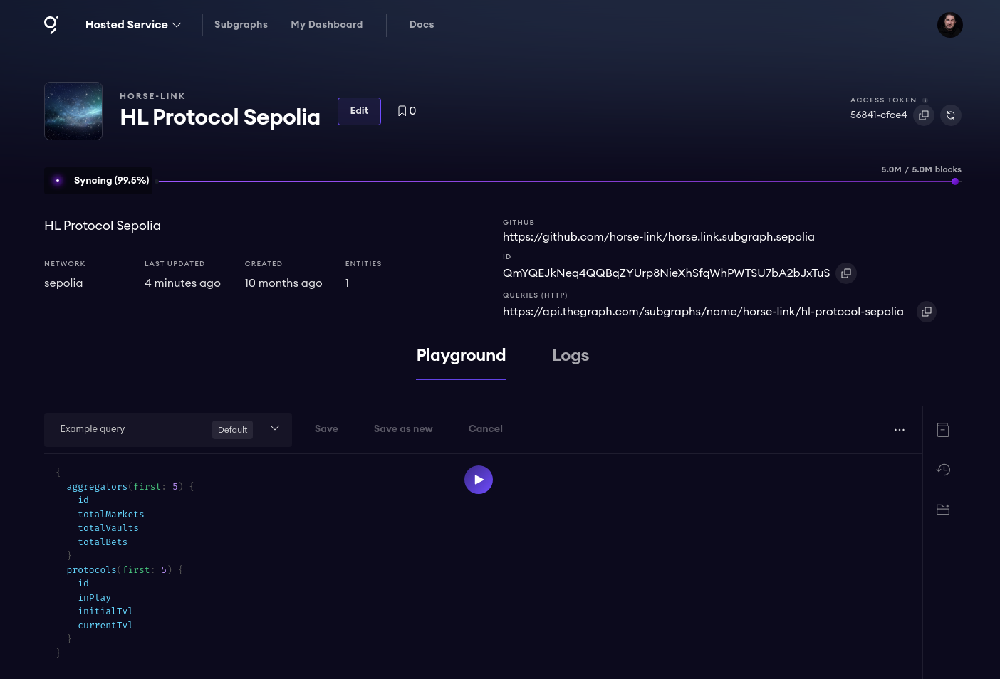

## TODO

https://thegraph.com/hosted-service/subgraph/horse-link/hl-protocol-sepolia

```bash
yarn install
yarn codegen
yarn build
```

Then get your access token from the graph dashboard.



```bash
graph auth --product hosted-service <token>
graph deploy --product hosted-service horse-link/hl-protocol-sepolia
``````